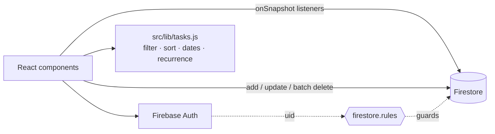

# Pro Task Manager

[](https://github.com/SASHI117/pro-task-manager/actions/workflows/ci.yml)


A personal task manager built with React, Firebase Authentication and
Cloud Firestore, styled with Tailwind. Each user's data lives in their own
Firestore subtree, and security rules lock it to that user. The UI updates
in real time through Firestore listeners.

## Features

- Email/password sign-up, login and password reset (Firebase Auth), with auth-guarded routes
- **Inbox, Today, Upcoming, per-project and per-tag views**, plus search, a priority filter and sorting (priority, due date, newest)
- Tasks with priority 1–4, due date, tags and **recurrence** (daily, weekly or monthly; completing a recurring task schedules the next one)
- Projects, and a comment thread per task
- Deleting a task also deletes its subtasks and comments, in one batched write
- Dark, light and "matrix" themes, saved per browser

## Architecture



```
users/{uid}/projects/{projectId}   name, createdAt
users/{uid}/tasks/{taskId}         text, priority, dueDate, tags[], recurrence, projectId, parentId, completed
users/{uid}/comments/{commentId}   taskId, text, user, createdAt
```

Putting everything under `users/{uid}` keeps the security rule to one line
and means no query can reach another user's data. The trade-off is that
sharing a project between users would need a different layout.

## Setup

1. Create a Firebase project. Enable **Email/Password** sign-in and **Cloud Firestore**.
2. Copy the web app config into `.env`:
   ```bash
   cp .env.example .env    # REACT_APP_* values from Project settings → Your apps
   ```
3. Deploy the security rules and the composite index that the comments query needs:
   ```bash
   npm i -g firebase-tools && firebase login
   firebase use <project-id>
   firebase deploy --only firestore:rules,firestore:indexes
   ```
4. Run it:
   ```bash
   npm ci
   npm start               # http://localhost:3000
   ```

`firebase.json` also configures SPA hosting: `npm run build && firebase deploy --only hosting`.

## Tests

```bash
npm run test:ci    # 19 tests
```

`src/lib/tasks.test.js` covers the logic that is easy to get wrong: local
vs UTC date parsing, month-end recurrence, each view filter, and sort
order. `src/App.test.jsx` checks that signed-out users are redirected to
login. CI runs the tests and a production build with lint warnings treated
as errors.

## Bugs fixed in this revision

| Symptom | Cause |
|---|---|
| Tasks due "today" appeared under yesterday for users west of UTC | `new Date("yyyy-mm-dd")` is parsed as **UTC** midnight; now parsed as local midnight |
| A monthly task due Jan 31 jumped to **Mar 3** | `setMonth(+1)` overflows; now clamps to the last day of the month |
| App stuck on "Loading Workspace..." | Firestore listeners had no error callback; permission or index errors were swallowed |
| Comments never appeared | The `taskId + createdAt` query needs a composite index; it is now in `firestore.indexes.json` |
| The priority dropdown did nothing, and sort couldn't be changed | Controls were bound to state nothing read, or were missing |
| Following the README produced an unconfigured app | It listed `VITE_*` variables. CRA reads `REACT_APP_*` |
| CI builds failed | Unused variables and a hook-dependency lint error |
| The test suite could not start | CRA's Jest can't resolve React Router v7's `exports`-only package |

## Limitations

- Subtasks are displayed and cascade-deleted, but the UI has no control to create one yet.
- Built on Create React App, which is in maintenance mode. Migrating to Vite would be the next infrastructure step.
