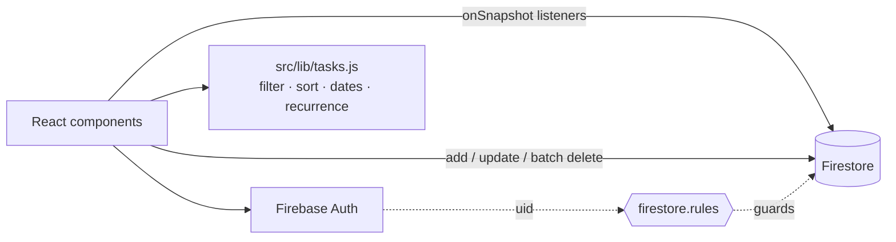

# Pro Task Manager

[](https://github.com/SASHI117/pro-task-manager/actions/workflows/ci.yml)


A personal task manager built with React, Firebase Authentication and
Cloud Firestore, styled with Tailwind. Each user's data lives in their own
Firestore subtree, and security rules lock it to that user. The UI updates
in real time through Firestore listeners.

## Features

- Email/password sign-up, login and password reset (Firebase Auth), with auth-guarded routes
- **Inbox, Today, Upcoming, per-project and per-tag views**, plus search, a priority filter and sorting (priority, due date, newest)
- Tasks with priority 1–4, due date, tags and **recurrence** (daily, weekly or monthly; completing a recurring task schedules the next one)
- Projects, and a comment thread per task
- Deleting a task also deletes its subtasks and comments, in one batched write
- Dark, light and "matrix" themes, saved per browser

## Architecture



```
users/{uid}/projects/{projectId}   name, createdAt
users/{uid}/tasks/{taskId}         text, priority, dueDate, tags[], recurrence, projectId, parentId, completed
users/{uid}/comments/{commentId}   taskId, text, user, createdAt
```

Putting everything under `users/{uid}` keeps the security rule to one line
and means no query can reach another user's data. The trade-off is that
sharing a project between users would need a different layout.

## Setup

1. Create a Firebase project. Enable **Email/Password** sign-in and **Cloud Firestore**.
2. Copy the web app config into `.env`:
   ```bash
   cp .env.example .env    # REACT_APP_* values from Project settings → Your apps
   ```
3. Deploy the security rules and the composite index that the comments query needs:
   ```bash
   npm i -g firebase-tools && firebase login
   firebase use <project-id>
   firebase deploy --only firestore:rules,firestore:indexes
   ```
4. Run it:
   ```bash
   npm ci
   npm start               # http://localhost:3000
   ```

`firebase.json` also configures SPA hosting: `npm run build && firebase deploy --only hosting`.

## Tests

```bash
npm run test:ci    # 19 tests
```

`src/lib/tasks.test.js` covers the logic that is easy to get wrong: local
vs UTC date parsing, month-end recurrence, each view filter, and sort
order. `src/App.test.jsx` checks that signed-out users are redirected to
login. CI runs the tests and a production build with lint warnings treated
as errors.

## Engineering highlights

- **Timezone-correct dates.** Due dates from `<input type="date">` are parsed as local midnight,
  so Today and Upcoming are right in every timezone.
- **Month-end-safe recurrence.** Monthly tasks clamp to the last day of the next month
  (Jan 31 → Feb 28/29), and the rule is covered by tests.
- **Resilient real-time sync.** Every Firestore listener has an error handler that surfaces
  permission and index problems in the UI.
- **Deployable config in the repo.** Security rules, the composite index for comments, and SPA
  hosting are all in `firebase.json` and deploy with one command.
- **CI-grade build.** Tests and a production build run on every push, with lint warnings treated
  as errors.

## Roadmap

- UI for creating subtasks (the data model and cascade delete already support them).
- Migration from Create React App to Vite.
- Shared projects between users.
